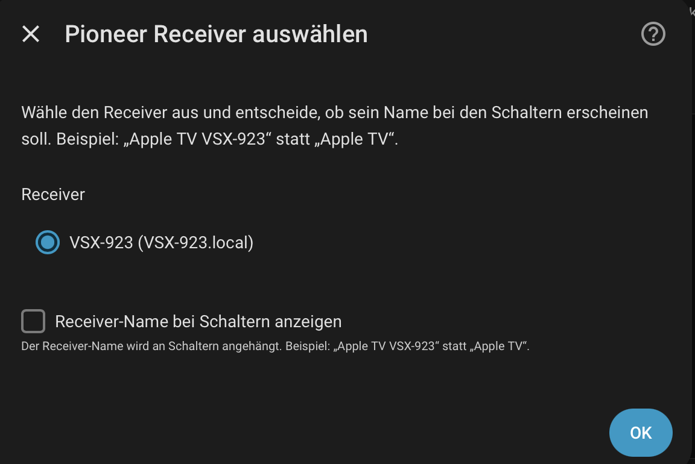
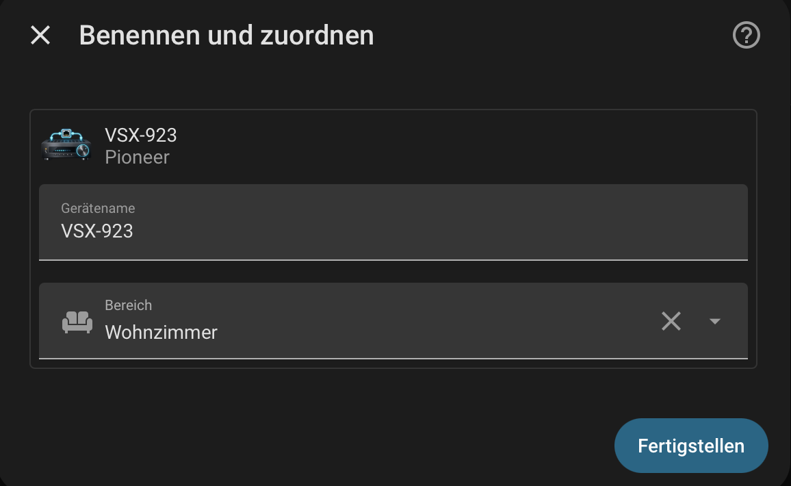
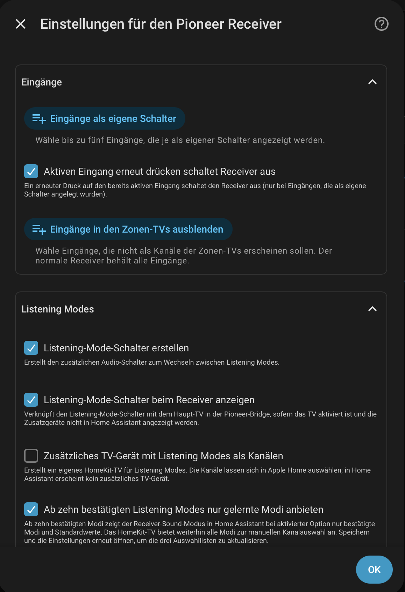
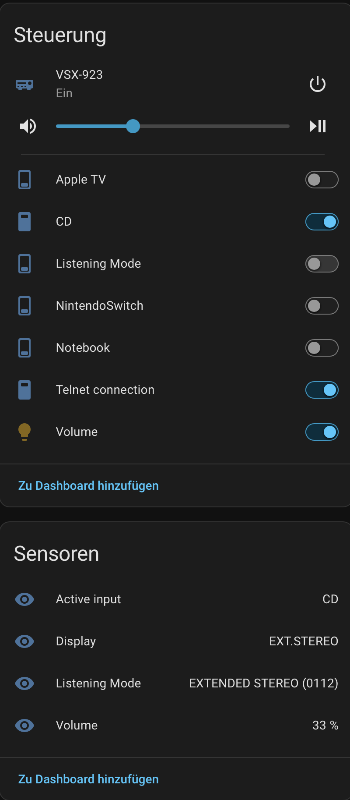
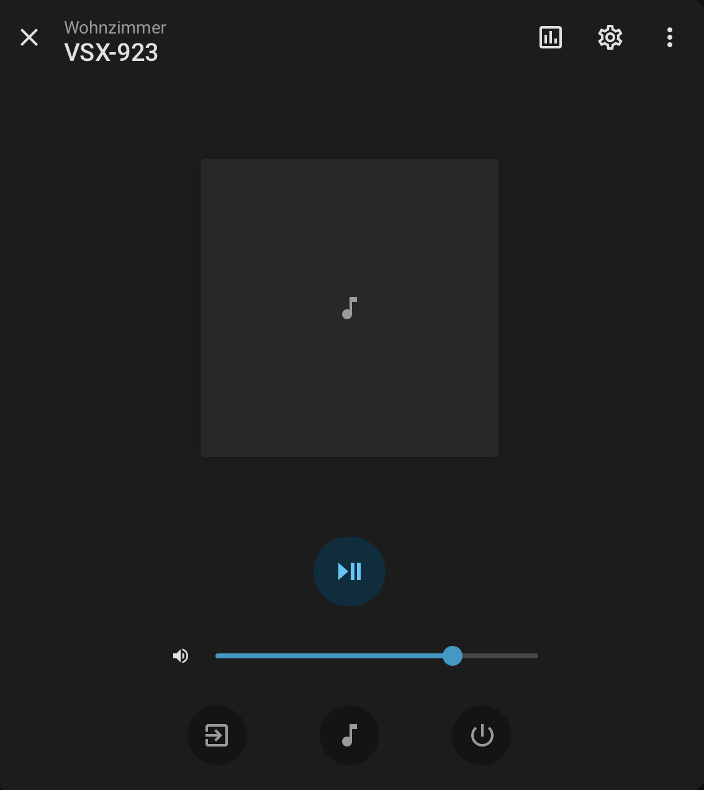
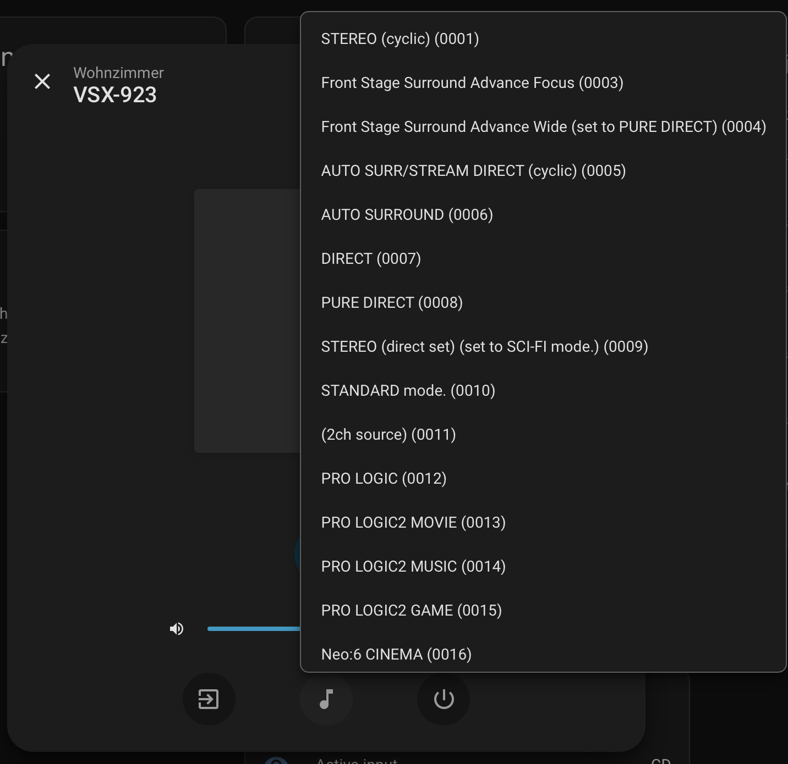

# Pioneer Telnet AVR

[Deutsch](README-DE.md)

Does your Pioneer receiver support Telnet? This Home Assistant integration
finds it on your network and makes inputs, volume, listening modes, and other
functions available in Home Assistant and Apple HomeKit. It is designed to
keep working through connection problems and reconnect to the receiver
automatically.

## Compatibility

Not every Pioneer receiver supports Telnet. This integration is intended for
models that understand **Pioneer Telnet commands**, such as the VSX-922,
VSX-923, and VSX-527. Newer models may use a different protocol such as ISCP;
the VSX-LX304, for example, is not suitable for this integration. What matters
is the supported protocol, not just the model name. Entering an IP address
manually cannot add Telnet support to a receiver.

## Add a receiver

In Home Assistant, go to **Settings → Devices & services → Add integration**
and add **Pioneer Telnet AVR**. The integration searches for your receiver. If
it finds several, select the one you want. Home Assistant may also suggest a
receiver it has discovered. If the search finds nothing, you can enter its
hostname or IP address manually.

During setup, choose for each receiver whether its name should be appended to
the names of its switches. You can then assign the device to an area.

## Configuration

Open **Configure** to choose which inputs become individual switches and which
additional functions you want. The configuration panel explains each option.
For example, you can create switches for up to five inputs, enable the
listening mode switch, and add the separate volume light.

The **Show additional entities in Home Assistant and use HomeKit Bridge**
option controls where these three types of additional devices appear. It is
off by default: the devices are then available only through the shared Pioneer
HomeKit bridge. When enabled, they appear in Home Assistant and can be exposed
through Home Assistant's HomeKit Bridge. The **Telnet connection** switch has
its own checkbox and appears in Home Assistant by default. Turn that option
off to include the switch in the Pioneer bridge instead.

The screenshots show a test version of the interface. Option names and
descriptions may differ in newer versions.

## Use the receiver in Home Assistant

The receiver device includes a media player and sensors for the active input,
display, listening mode, and volume. Individual input and listening mode
switches and the separate volume light appear here only if you enable the
corresponding option. In the media player, you can change the volume and input
and select a listening mode.

## Set up devices in Apple Home

The integration provides **one shared Pioneer HomeKit bridge** for all
configured receivers. It contains the enabled TV devices and, when the option
to show additional entities in Home Assistant is off, their input switches,
listening mode switches, and separate volume lights. You can also use **Home
Assistant's HomeKit Bridge** for additional devices exposed in Home Assistant:

1. Open the **Pioneer HomeKit Bridge** notification in Home Assistant and pair
   the bridge with Apple Home using its QR code. **One QR code is enough** for
   all enabled Pioneer TVs and directly exposed additional devices, even with
   several receivers. You can select which TV channels appear in Apple Home.
2. If you enabled **Show additional entities in Home Assistant and use HomeKit
   Bridge**, add Home Assistant's **HomeKit Bridge** integration. Select the
   input switches, separate volume light, and listening mode switch you want,
   then pair that bridge as well. These devices do not also appear in the
   Pioneer bridge. Independently, the Telnet connection switch can remain in
   Home Assistant or be exposed through the Pioneer bridge.
3. If the main Pioneer TV is enabled, exclude the receiver's regular media
   player from Home Assistant's HomeKit Bridge. Otherwise the receiver will
   appear as a second TV device.

**Upgrading from earlier versions:** Remove the Pioneer TVs that were paired
individually from Apple Home and pair the shared Pioneer bridge instead. Their
new HomeKit identifiers cannot be carried over from the individual pairings.
Your Home Assistant HomeKit Bridge can stay if you use it for other devices.

The listening mode and MCACC TVs follow the receiver's power state. Pressing
the power button on either TV does not turn the receiver off; the display
returns to its actual state. If you choose to show the listening mode switch
with the receiver, it is also linked to the main TV in the Pioneer bridge when
that TV is enabled.

Consider placing the volume light and input switches in a separate room in
Apple Home. This prevents commands such as “turn off all lights in the living
room” from controlling them accidentally.

## Connection

If the connection drops, the integration tries to find the receiver and
reconnect automatically.

Source code and issues: [GitHub – pioneer-telnet-avr](https://github.com/holuspokus/pioneer-telnet-avr).

## License

This project is licensed under the [ISC License](LICENSE).
